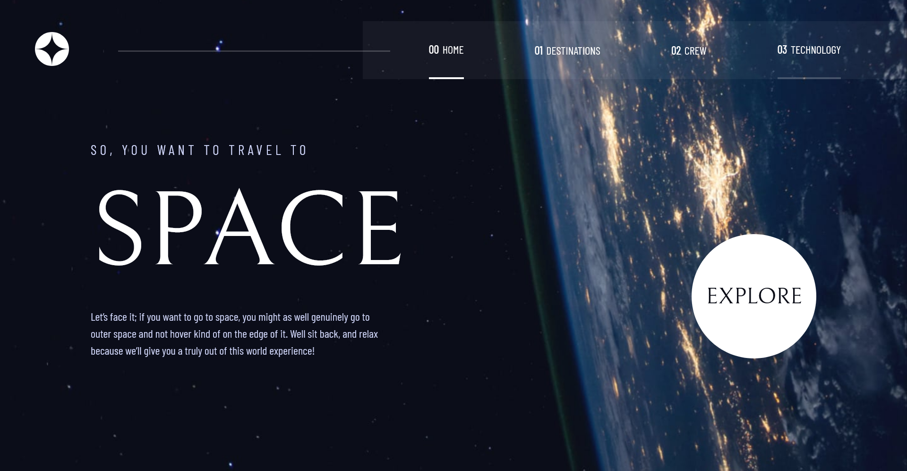

# Frontend Mentor - Entertainment web app solution

My solution to [Space Tourism Website Challenge](https://www.frontendmentor.io/challenges/space-tourism-multipage-website-gRWj1URZ3) by Front End Mentor.

## Table of contents

- [Overview](#overview)
  - [The challenge](#the-challenge)
  - [Screenshot](#screenshot)
  - [Links](#links)
- [My process](#my-process)
  - [Built with](#built-with)
  - [What I learned](#what-i-learned)
- [Author](#author)

## Overview

### The challenge

Users should be able to:

- View the optimal layout for each of the website's pages depending on their device's screen size
- See hover states for all interactive elements on the page
- View each page and be able to toggle between the tabs to see new information

### Screenshot

### Links

- Solution URL: [Frontend Mentor](https://www.frontendmentor.io/solutions/space-tourism-website-react-1okYJPVbh_)
- Live Site URL: [Netlify](https://hcfspacetourism.netlify.app/technology)

## My process

### Built with

- Semantic HTML5 markup
- SASS
- React
- React Router

### What I learned

That was for me the first time using Reactr Router, it was very funny.

## Author

- Website - [Federico Graziani](https://grazianifederico.it)
- Frontend Mentor - [@herecomesfed](https://www.frontendmentor.io/profile/herecomesfed)
